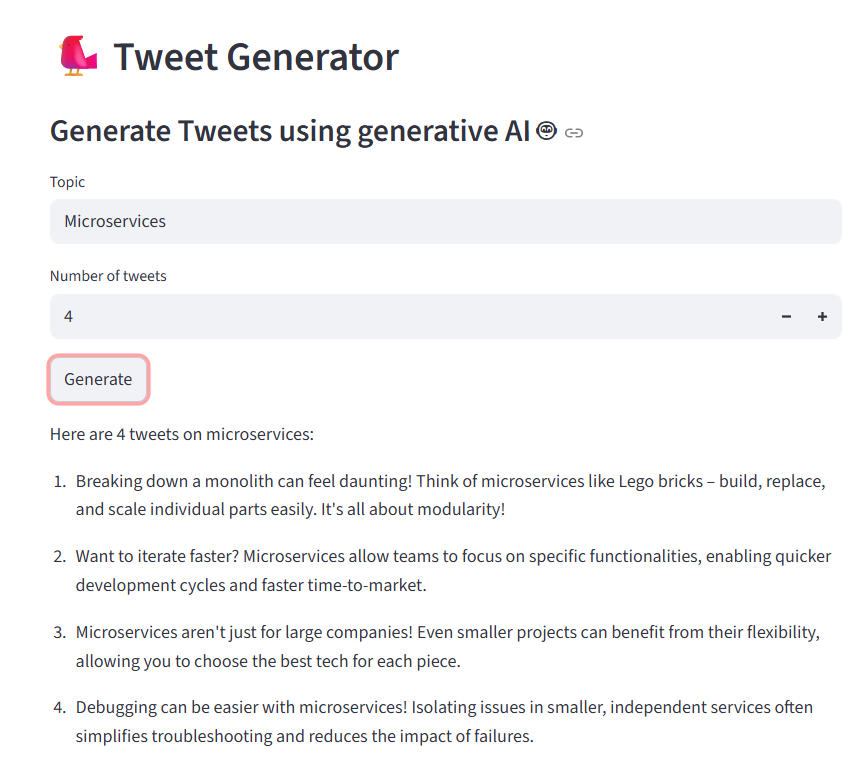

# 🐦 Tweet Generation App

A powerful AI-powered tweet generator built with Python, Streamlit, and Google's Gemini AI model. This application helps users create engaging, creative, and optimized tweets on any topic instantly.

## 📋 Table of Contents

- [Features](#features)
- [Try the App](#try-the-app)
- [Preview](#preview)
- [Technologies Used](#technologies-used)
- [Requirements](#requirements)
- [Installation](#installation)
- [Configuration](#configuration)
- [Running the Project](#running-the-project)
- [Usage Guide](#usage-guide)
- [Project Structure](#project-structure)
- [Author](#author)

## ✨ Features

- **AI-Powered Tweet Generation**: Generates creative and engaging tweets using Google's Gemini 2.0 Flash Lite model
- **Customizable Output**: Specify the number of tweets (1-10) to generate per request
- **Flexible Topic Selection**: Generate tweets on any topic of your choice
- **Smart Content Rules**: Automatically applies content guidelines:

  - Avoids controversial, political, sensitive, or negative content
  - Maintains a friendly, positive, and helpful tone
  - Keeps tweets under 280 characters (Twitter limit)
  - Ensures unique and non-repetitive content
  - Uses hashtags and emojis judiciously

- **User-Friendly Interface**: Built with Streamlit for an intuitive web-based experience
- **Social Media Integration**: Direct links to Twitter and GitHub profiles

## 🌐 Try the App

**Live Demo**: <a href="https://tweetgenerationaiapp.streamlit.app/" target="_blank">https://tweetgenerationaiapp.streamlit.app/</a>

Click the link above to access the deployed application on Streamlit Cloud. No installation required!

## 📸 Preview

The application features a clean and intuitive interface:


## 🛠️ Technologies Used

- **Python 3.11**: Core programming language
- **Streamlit**: Web framework for building the UI
- **LangChain**: Framework for building applications with language models
- **Google Gemini AI**: Advanced generative AI model for tweet generation
- **Streamlit Extras**: Additional Streamlit components (badges)

## 📦 Requirements

The project requires the following Python packages:

```
langchain
langchain-openai
langchain-google-genai
streamlit
streamlit-extras
```

## 🚀 Installation

### Prerequisites

- Python 3.8 or higher installed on your system
- A Google API key for accessing the Gemini model

### Step 1: Clone the Repository

```bash
git clone https://github.com/AnusrutaD/tweet-generating-app.git
cd tweet-generating-app
```

### Step 2: Create a Virtual Environment

It's recommended to use a virtual environment to avoid dependency conflicts.

**On Windows (PowerShell):**

```powershell
python -m venv venv
.\venv\Scripts\Activate.ps1
```

**On macOS/Linux:**

```bash
python3 -m venv venv
source venv/bin/activate
```

### Step 3: Install Dependencies

```bash
pip install -r rquirements.txt
```

## 🔑 Configuration

### Setting Up Google API Key

1. Go to [Google Cloud Console](https://console.cloud.google.com/)
2. Create a new project
3. Enable the Generative Language API
4. Create an API key
5. Replace the placeholder API key in `main.py` with your actual key:

```python
os.environ['GOOGLE_API_KEY'] = "YOUR_GOOGLE_API_KEY_HERE"
```

> **Security Note**: For production environments, store your API key in environment variables or a `.env` file. Never hardcode sensitive keys in your source code.

## ▶️ Running the Project

### Start the Streamlit Application

```bash
streamlit run main.py
```

The application will open in your default web browser at `http://localhost:8501`

## 📖 Usage Guide

1. **Open the Application**: After running the command above, the Streamlit interface will load in your browser

2. **Enter a Topic**: Type the topic you want tweets to be generated about in the text input field

3. **Specify Tweet Count**: Use the number input to select how many tweets to generate (1-10)

4. **Generate Tweets**: Click the "Generate" button to create tweets

5. **View Results**: The AI-generated tweets will be displayed below the button

### Example Usage

- **Topic**: "Artificial Intelligence"
- **Number of Tweets**: 5
- **Output**: 5 unique, engaging tweets about AI, each under 280 characters

## 📁 Project Structure

```
tweet-generating-app/
├── main.py              # Main application file
├── README.md            # Project documentation (this file)
├── rquirements.txt      # Python dependencies
└── .gitignore          # Git ignore rules
```

## 📄 File Descriptions

### main.py

The main application file containing:

- Streamlit UI configuration
- LangChain prompt template for tweet generation
- Google Gemini model initialization
- Input handling for topic and tweet count
- Tweet generation logic and display

## 🤝 How It Works

1. User inputs a topic and desired number of tweets
2. The application uses LangChain's PromptTemplate to structure the request
3. Google's Gemini 2.0 Flash Lite model processes the request
4. The AI generates creative, contextually appropriate tweets
5. Results are displayed in the Streamlit interface

## 📝 Content Guidelines

The application enforces the following guidelines for tweet generation:

- No controversial or political content
- No sensitive or negative messaging
- Friendly and positive tone
- Helpful and informative content
- Character limit adherence (280 characters max)
- Unique and non-repetitive tweets
- Minimal use of hashtags and emojis

## 🐛 Troubleshooting

### Issue: "API Key Invalid"

- Ensure your Google API key is correctly set in `main.py`
- Verify the key has access to the Generative Language API

### Issue: "Module not found"

- Ensure you've activated the virtual environment
- Reinstall dependencies: `pip install -r rquirements.txt`

### Issue: Application won't start

- Check that Streamlit is installed: `pip install streamlit`
- Ensure you're in the correct project directory

## 📧 Author

**Anusruta Dutta**

Connect with me on:

- **GitHub**: [AnusrutaD](https://github.com/AnusrutaD)
- **LinkedIn**: [Anusruta Dutta](https://www.linkedin.com/in/anusruta-dutta/)
- **LeetCode**: [anusruta_dutta](https://leetcode.com/u/anusruta_dutta/)
- **X (Twitter)**: [@AnusrutaDutta](https://x.com/AnusrutaDutta)

---

**Happy Tweeting! 🐦✨**
